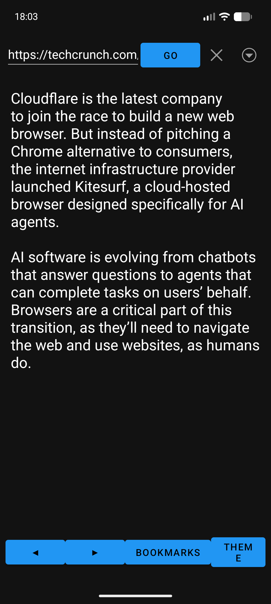

# TextReader

A lightweight text-mode browser for Android. It fetches web pages and PDFs and shows them as clean, readable text — no rendering engine, no ads, no clutter. A mobile port of the terminal browser `text_browser.py`.



## Purpose

Browsing the web usually means fighting pop-ups, autoplay videos, and heavy layouts. TextReader strips all of that away and gives you just the words: articles, blog posts, forum threads and PDF documents as plain text that is fast to load and comfortable to read. It is also privacy-friendly — ad and tracker links are filtered out by default (safe mode).

## Download

Get the latest APK from the **Releases** page:

**[Releases](https://github.com/adegard/TextBrowserApp/releases)**

Download `app-debug.apk` and open it on your phone to install (you may need to allow "Install unknown apps" for your file manager).

## Features

- **Search** — 5 search engines: DuckDuckGo Lite, DuckDuckGo HTML, Brave, Bing, and Google (text mode). Every engine falls back to DuckDuckGo Lite if it returns nothing.
- **Article reader** — extracts the main text from any web page (largest-content heuristic), along with its links, title and image. Unreadable clutter (scripts, nav, ads) is removed.
- **PDF reading** — open any `.pdf` URL and read its text, page by page, with the title taken from the document metadata.
- **Block navigation** — text is split into blocks; turn pages by swiping left/right or with the ◀ ▶ buttons. Multi-page articles (`/page/N`) load the next part automatically at the end.
- **Vertical scroll** — when a block is taller than the screen, drag to scroll (a scrollbar appears on the side).
- **Bookmarks** — save the current position of any page and resume exactly where you left off. Remove them via ⋮ → *Remove bookmark* or the *Remove…* button in the bookmarks list.
- **History** — a chronology of visited pages (length configurable, deduplicated).
- **Links list** — view every link found on the current page and open any of them.
- **I'm feeling lucky** — type `ifl query` to jump straight to the first search result.
- **Share** — share the current page title and link via the Android share sheet.
- **Ask AI (Groq)** — ask a question, or leave the field blank to get a summary of the current page. Powered by the Groq API (`llama-3.1-8b-instant`); set your API key in Settings.
- **Compact URL** — the address bar stays on one line and the page header shows the URL with its middle shortened.
- **Text zoom** — adjust the reading text size with A+ / A− (10–28sp), persisted.
- **Read aloud (TTS)** — tap **TTS** in the bottom bar to hear the current page read out loud, block by block. The sentence being read is highlighted; when a block finishes it auto-advances to the next one. The voice auto-detects the language of the page you're reading (from `<html lang>` or a content heuristic) and uses it for both engines.
- **Voice modes** — Settings → Voice: *auto* (offline engine, online fallback), *offline only*, or *online always*. If your phone has no TTS engine installed, the app automatically uses an online voice — no engine needed.
- **Voice speed** — Settings → Voice speed lets you set 0.5×–2.0×, applied to both the offline engine and the online voice.
- **Day / Night themes** — toggle via ⋮ → *Toggle theme*.
- **Data backup** — Settings → Export/Import saves your settings, bookmarks and history to a JSON file (via the system file picker), so you can move them between devices.
- **Settings** — search engine, results per page, paragraphs per page, max characters per block, chronology length, text size, Groq API key, voice mode/language/speed, toggles for showing the page title, page number, and compact URL.

## Usage

1. Type a **URL** (e.g. `en.wikipedia.org`) or a **search query** into the top field, then tap **Go**.
2. Swipe left/right — or use ◀ ▶ — to move between blocks of text.
3. Use the **⋮** menu for Home, Links, History, Settings, Share, I'm feeling lucky, Ask AI, Save/Remove bookmark, text zoom, theme, and Exit.
4. Tap **✕** to clear the address bar.
5. Tap **TTS** to read the page aloud (tap again to stop). Use **Bookmarks** to manage saved pages.
6. Swipe up/down to scroll when a block is taller than the screen.

## Build

The APK is built by GitHub Actions on every push (`assembleDebug`) and uploaded as the `app-debug-apk` artifact.

```bash
./gradlew assembleDebug
```

APK output: `app/build/outputs/apk/debug/app-debug.apk`
